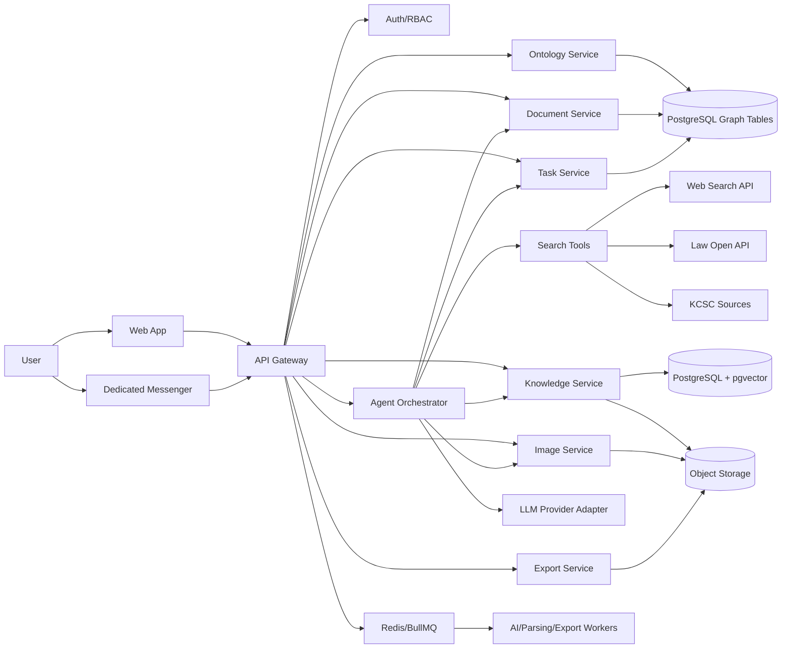

# ARCHI Agent Studio Architecture

**버전:** v1.0  
**목적:** Claude Code가 구현할 수 있는 수준의 기술 구조, 모듈 경계, 데이터 흐름, 배포 구조 정의

---

## 1. 권장 기술 스택

### 1.1 기본 원칙

- MVP는 빠른 구현과 유지보수를 위해 TypeScript 중심으로 간다.
- AI, 문서 파싱, 이미지 후처리 등 Python 생태계가 유리한 기능은 Worker로 분리한다.
- AI 모델, 이미지 모델, 검색 API는 Provider Adapter 패턴으로 추상화한다.
- 온톨로지는 초기에 PostgreSQL 테이블 기반 graph model로 시작하고, 고도화 시 Neo4j 등 Graph DB로 확장한다.

### 1.2 Frontend

| 영역 | 권장 선택 |
|---|---|
| Framework | Next.js + React + TypeScript |
| UI | Tailwind CSS, shadcn/ui 계열 컴포넌트 |
| Editor | Tiptap, Plate, BlockNote 중 하나. MVP는 JSON block model과 쉽게 연결되는 라이브러리 선택 |
| State | Zustand 또는 React Query |
| Realtime | WebSocket, Server-Sent Events, Supabase Realtime 중 선택 |
| Graph | React Flow, Cytoscape.js, Sigma.js 중 선택 |
| Canvas/Image Mask | Fabric.js 또는 Konva.js |

### 1.3 Backend

| 영역 | 권장 선택 |
|---|---|
| API | Next.js Route Handlers 또는 NestJS/Fastify |
| DB | PostgreSQL |
| ORM | Prisma |
| Vector | pgvector, 초기 단순화. 대규모 확장 시 전용 Vector DB 검토 |
| Queue | Redis + BullMQ |
| Object Storage | S3 호환 스토리지, Cloudflare R2 가능 |
| Auth | Auth.js, Clerk, Supabase Auth 중 하나 |
| Export | Markdown/TXT는 서버 직접 생성, PDF는 Playwright/Chromium, DOCX는 docx 라이브러리 |
| Observability | Sentry, OpenTelemetry, structured logging |

### 1.4 AI Layer

| 모듈 | 설명 |
|---|---|
| LLM Provider Adapter | Claude, OpenAI, Gemini 등 교체 가능하게 추상화 |
| Search Provider Adapter | 웹 검색, 법령 API, KCSC, 내부 KB 검색 |
| Image Provider Adapter | 이미지 생성, 인페인트, 업스케일을 provider별 구현으로 분리 |
| Tool Router | agent action을 안전한 내부 함수 호출로 변환 |
| RAG Pipeline | query rewrite, retrieval, rerank, answer with citations |
| Ontology Extractor | 문서에서 노드·엣지 후보 추출 |
| Evaluation | 법규 답변 출처 포함률, hallucination 테스트, golden Q&A |

---

## 2. 시스템 구성도



---

## 3. Repository 구조

```text
archi-agent-studio/
├─ apps/
│  ├─ web/                         # Next.js web app
│  ├─ api/                         # API server, optional if separate from web
│  └─ worker/                      # queue workers, parsing, export, AI jobs
├─ packages/
│  ├─ db/                          # Prisma schema, migrations, db client
│  ├─ shared/                      # shared types, zod schemas, constants
│  ├─ ai/                          # LLM adapters, prompt templates, tool router
│  ├─ editor/                      # block schema, renderer, editor utilities
│  ├─ export/                      # markdown/txt/pdf/docx/html exporters
│  ├─ ontology/                    # graph schema, extraction, visualization helpers
│  ├─ knowledge/                   # ingestion, chunking, retrieval
│  ├─ image/                       # generation/inpainting adapters
│  └─ security/                    # RBAC, audit helpers, prompt injection filters
├─ docs/
│  ├─ PRD.md
│  ├─ ARCHITECTURE.md
│  ├─ DEVELOPMENT_PLAN.md
│  ├─ API_SPEC.md
│  └─ DATA_MODEL.md
├─ .claude/
│  ├─ settings.json                # project-scoped Claude Code settings
│  ├─ agents/                      # custom subagents
│  └─ commands/                    # repeatable development commands
├─ CLAUDE.md                       # Claude Code project rules
├─ package.json
├─ pnpm-workspace.yaml
└─ README.md
```

---

## 4. 핵심 서비스 경계

### 4.1 Document Service

책임:
- 프로젝트별 문서 CRUD
- 블록 생성/수정/삭제/정렬
- 블록 버전 저장
- 문서 export 요청 생성

비책임:
- AI 답변 생성
- 이미지 생성
- 파일 파싱

### 4.2 Agent Orchestrator

책임:
- 사용자 메시지 의도 분류
- 도구 선택
- RAG/search/image/editor action 호출
- 구조화 action 생성
- 사용자 승인 필요 여부 판단

주요 action:
- `insert_blocks`
- `update_block`
- `create_document`
- `search_sources`
- `generate_image`
- `inpaint_image`
- `create_task`
- `query_knowledge_base`
- `propose_ontology_update`

### 4.3 Knowledge Service

책임:
- 파일/URL source 등록
- 텍스트 추출
- chunk 생성
- embedding 저장
- retrieval
- citation 생성
- 소스 승인 상태 관리

### 4.4 Ontology Service

책임:
- node/edge CRUD
- source/chunk 연결
- 그래프 API
- AI 추출 후보 관리
- 관리자 승인

### 4.5 Image Service

책임:
- 이미지 업로드
- 이미지 생성 요청
- 인페인트 요청
- 버전 관리
- storage URL 발급

### 4.6 Messenger/Task Service

책임:
- 채널/메시지 관리
- 메시지 기반 task 생성
- 작업 상태 전파
- 산출물 링크 연결

---

## 5. 데이터 플로우

### 5.1 AI 글 생성

```text
User prompt
→ Chat API
→ Context builder: current document + selected blocks + project memory
→ Search/RAG 필요 여부 판단
→ LLM draft
→ AgentAction: insert_blocks
→ Document Service writes blocks
→ UI streams assistant message and renders new blocks
```

### 5.2 법규·시공 질문

```text
User question
→ Intent classifier: legal/construction_detail
→ Search official sources and approved KB
→ Retrieve top chunks
→ Rerank
→ Generate answer with citations and uncertainty
→ Optional insert source_reference/checklist blocks
```

### 5.3 지식베이스 업로드

```text
File upload
→ Object Storage
→ KnowledgeSource pending_processing
→ Worker extracts text
→ Chunking
→ Embedding
→ Ontology candidate extraction
→ pending_review
→ Admin approval
→ approved chunks usable in RAG
```

### 5.4 이미지 생성과 인페인트

```text
Prompt or selected block
→ Image prompt builder
→ Image provider adapter
→ ImageAsset + ImageVersion created
→ Document image block inserted
→ User selects mask
→ Inpaint provider adapter
→ New ImageVersion created
→ Replace or add variant in document
```

### 5.5 메신저 업무지시

```text
Messenger message
→ Intent parser
→ Task created
→ Orchestrator assigns agent
→ Worker executes long job
→ Task events emitted
→ Output document/image/answer linked
→ User review required
```

---

## 6. Provider Adapter 인터페이스

### 6.1 LLM Adapter

```ts
export interface LlmProvider {
  generateText(input: GenerateTextInput): Promise<GenerateTextResult>;
  streamText(input: GenerateTextInput): AsyncIterable<StreamChunk>;
  generateStructured<T>(input: StructuredInput<T>): Promise<T>;
}
```

### 6.2 Search Adapter

```ts
export interface SearchProvider {
  search(query: string, options: SearchOptions): Promise<SearchResult[]>;
  fetchDocument(urlOrId: string): Promise<SourceDocument>;
}
```

### 6.3 Image Adapter

```ts
export interface ImageProvider {
  generate(input: ImageGenerateInput): Promise<ImageGenerateResult>;
  inpaint(input: ImageInpaintInput): Promise<ImageInpaintResult>;
}
```

### 6.4 Export Adapter

```ts
export interface Exporter {
  export(document: DocumentWithBlocks, options: ExportOptions): Promise<ExportResult>;
}
```

---

## 7. API 개요

상세는 `API_SPEC.md`를 따른다.

| Method | Path | 설명 |
|---|---|---|
| POST | /api/documents | 문서 생성 |
| GET | /api/documents/:id | 문서 조회 |
| PATCH | /api/documents/:id | 문서 메타 수정 |
| POST | /api/documents/:id/blocks | 블록 추가 |
| PATCH | /api/blocks/:id | 블록 수정 |
| POST | /api/ai/chat | AI 채팅 |
| POST | /api/search | 검색 |
| POST | /api/images/generate | 이미지 생성 |
| POST | /api/images/inpaint | 이미지 인페인트 |
| POST | /api/kb/sources | 지식 소스 등록 |
| POST | /api/kb/query | KB 질의 |
| GET | /api/ontology/graph | 온톨로지 그래프 조회 |
| POST | /api/exports | export job 생성 |
| POST | /api/tasks | 작업 생성 |
| GET | /api/tasks/:id | 작업 조회 |

---

## 8. 권한 모델

| Role | 권한 |
|---|---|
| Owner | 결제, 조직 삭제, 모든 권한 |
| Admin | 멤버 관리, 지식 승인, 온톨로지 편집 |
| Editor | 문서 생성/수정, AI 사용, 이미지 생성 |
| Viewer | 문서 조회, export 제한 가능 |
| Knowledge Reviewer | 지식베이스 승인, 출처 검증 |

AI 작업도 사용자 권한을 상속한다. Viewer가 AI에게 지식 삭제를 요청해도 수행되지 않아야 한다.

---

## 9. 보안 설계

1. 모든 API는 workspaceId 권한을 검증한다.
2. Object Storage path는 organization/workspace/project 단위로 격리한다.
3. Signed URL은 짧은 만료 시간을 사용한다.
4. 외부 검색 결과는 prompt injection 방어 필터를 통과한다.
5. AgentAction은 서버 allowlist와 zod schema 검증 후 실행한다.
6. destructive action은 confirmation_required 상태로 반환한다.
7. AuditLog에는 actor, action, target, before/after, timestamp를 저장한다.

---

## 10. 테스트 전략

| 테스트 | 대상 |
|---|---|
| Unit | block schema, exporter, prompt builder, parser |
| Integration | API + DB, queue worker, storage upload |
| E2E | 문서 생성 → AI 삽입 → export 다운로드 |
| RAG Eval | 법규/공법 질문 golden set, 출처 포함률 |
| Security | prompt injection fixture, 권한 우회 테스트 |
| Visual | editor layout, ontology graph, image mask UI |
| Export QA | Markdown/TXT/PDF/DOCX 출력 비교 |

---

## 11. Claude Code 개발 전략

Claude Code는 코드베이스를 읽고 파일을 수정하고 명령을 실행할 수 있으므로, repo에 명확한 PRD, CLAUDE.md, 테스트 스크립트, 작은 작업 단위를 제공해야 한다.

권장 운영 방식:

1. `CLAUDE.md`에 제품 목표, 금지사항, 아키텍처 원칙, 코딩 규칙을 작성한다.
2. 기능을 Epic → Story → Task 단위로 작게 나눈다.
3. Claude Code에게 “먼저 계획, 그 다음 구현, 마지막 테스트” 규칙을 강제한다.
4. MCP는 GitHub, DB, 이슈 관리, 브라우저 테스트 등 필요한 도구부터 연결한다.
5. Hooks는 lint/test 자동 실행, 보안 검사, 포맷 검증에 사용한다.
6. Subagents는 frontend, backend, AI/RAG, QA, security 등으로 분리한다.
7. 긴 작업은 branch 단위로 수행하고, commit 전 test 결과를 요약하게 한다.
