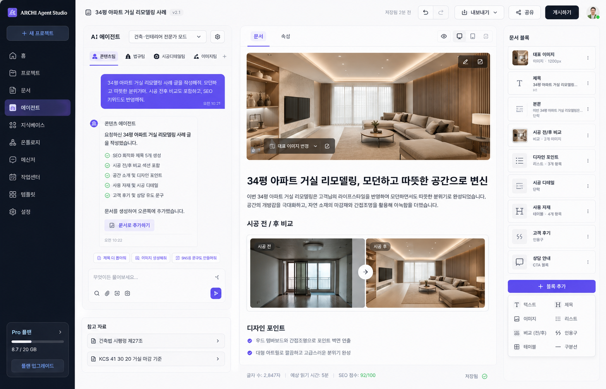

# UI 레퍼런스 — 스튜디오(에이전트) 화면

**목적:** 코딩 에이전트가 메인 작업 화면(Studio)을 구현할 때 참고하는 시각/구조 스펙.
**출처:** 사용자 제공 UI 샘플(목업) 1컷. 원본 이미지는 `docs/design/images/studio-screen.png`에 저장(추가 방법: [images/README.md](images/README.md)).
**상태:** 디자인 목업 기준. 실제 토큰값(색상 hex, spacing)은 근사치이며 구현 시 디자인 시스템으로 확정.

> 원본 PNG 추가 방법: `docs/design/images/studio-screen.png` 로 파일을 저장하면 아래 미리보기가 연결됩니다.
>
> 

---

## 1. 전체 레이아웃

좌→우 4개 영역으로 구성된 앱 셸(App Shell). 상단에 글로벌 탑바.

```
┌──────────┬─────────────────────────────────────────────────────────────┐
│          │  [탑바] 문서 제목 · 저장상태 · undo/redo · 내보내기 · 공유 · 게시 │
│  좌측    ├──────────────┬───────────────────────────────┬──────────────┤
│  내비    │  에이전트     │  문서 프리뷰 / 에디터          │  문서 블록   │
│ 사이드바  │  패널         │  (메인 캔버스)                 │  아웃라인    │
│ (다크)   │              │                               │  패널        │
│          │  참고 자료    │                               │  블록 팔레트 │
│          ├──────────────┤                               │              │
│  플랜     │              │                               │              │
└──────────┴──────────────┴───────────────────────────────┴──────────────┘
```

| 영역 | 폭(근사) | 배경 |
|---|---|---|
| 좌측 내비 사이드바 | ~210px 고정 | 다크 네이비 (`#171B2E` 계열) |
| 에이전트 패널 | ~360px | 화이트, 우측 경계선 |
| 문서 프리뷰/에디터 (메인) | 가변(flex-1) | 화이트 |
| 문서 블록 패널 | ~300px | 화이트, 좌측 경계선 |

---

## 2. 좌측 내비 사이드바 (다크)

- **로고:** 좌상단 ARCHI 마크(둥근 사각 아이콘) + `ARCHI Agent Studio` 워드마크.
- **`+ 새 프로젝트` 버튼:** 풀폭, 인디고/블루 채움(`#4F46E5`~`#6366F1`), 흰 텍스트, 둥근 모서리.
- **내비 항목(아이콘 + 라벨):** 홈, 프로젝트, 문서, **에이전트(활성)**, 지식베이스, 온톨로지, 메신저, 작업센터, 템플릿, 설정.
  - 활성 항목은 살짝 밝은 배경(`#252B45` 계열)으로 하이라이트.
- **하단 플랜 카드:** `Pro 플랜` 라벨 + `>` 화살표, 스토리지 게이지 바(`8.7 / 20 GB`), `플랜 업그레이드` 버튼.
- **우상단(탑바 영역) 사용자 아바타:** 원형 프로필 + 온라인 그린 닷.

---

## 3. 글로벌 탑바

좌→우:
- 문서 아이콘 + 문서 제목 `34평 아파트 거실 리모델링 사례` + 버전 배지 `v2.1`(연한 회색 pill).
- 중앙 우측: `저장됨 2분 전`(회색 텍스트), undo/redo 아이콘 버튼 2개.
- 우측 액션: `내보내기 ▾`(드롭다운, 아웃라인 버튼), `공유`(아웃라인 버튼), `게시하기`(검정 채움 버튼, 흰 텍스트).
- 맨 우측: 사용자 아바타(그린 닷).

---

## 4. 에이전트 패널 (좌측 중앙 컬럼)

### 4.1 헤더
- `AI 에이전트` 타이틀(좌측 작은 AI 뱃지 아이콘).
- 모드 셀렉트 드롭다운: `건축·인테리어 전문가 모드 ▾`.
- 우측 설정 기어 아이콘.

### 4.2 에이전트 팀 탭
가로 탭: **콘텐츠팀(활성, 밑줄/인디고)**, 법규팀, 시공디테일팀, 이미지팀, `+`(팀 추가).
- 각 탭 앞에 작은 아이콘. 활성 탭은 인디고 밑줄 + 진한 텍스트.

### 4.3 대화 영역
- **사용자 메시지 버블:** 우측 정렬, 인디고/퍼플 채움(`#6366F1` 계열), 흰 텍스트, 둥근 말풍선. 우하단 타임스탬프(`오전 10:21`).
  - 샘플 내용: "34평 아파트 거실 리모델링 사례 글을 작성해줘. 모던하고 따뜻한 분위기야. 시공 전후 비교도 포함하고, SEO 키워드도 반영해줘."
- **에이전트 응답:** 좌측 정렬, 아바타 + `콘텐츠 에이전트` 이름.
  - 본문 + 체크 아이콘 불릿 리스트(그린 체크):
    - SEO 최적화 제목 5개 생성
    - 시공 전/후 비교 섹션 포함
    - 공간 소개 및 디자인 포인트
    - 사용 자재 및 시공 디테일
    - 고객 후기 및 상담 유도 문구
  - 하단 안내문 `문서를 생성하여 오른쪽에 추가했습니다.`
  - **`📄 문서로 추가하기`** 액션 버튼(연한 인디고 배경).
  - 타임스탬프 `오전 10:22`.

### 4.4 빠른 액션 칩
응답 아래 가로 배열 chip 버튼: `제목 더 뽑아줘`, `이미지 생성해줘`, `SNS용 문구도 만들어줘`. (아웃라인 pill, 좌측 작은 아이콘.)

### 4.5 입력창
- 플레이스홀더 `무엇이든 물어보세요...`.
- 하단 좌측 아이콘 그룹: 검색, 첨부(클립), 이미지, 카메라.
- 우하단 전송 버튼(인디고 원형, 종이비행기/화살표 아이콘).
- 우상단 공유/분기 아이콘 1개.

### 4.6 참고 자료 (패널 하단)
`참고 자료` 섹션 제목 + 카드 리스트(각 행 우측 `>`):
- `📄 건축법 시행령 제27조`
- `📄 KCS 41 30 20 거실 마감 기준`

---

## 5. 문서 프리뷰 / 에디터 (메인 캔버스)

### 5.1 상단 탭 & 뷰 토글
- 탭: **문서(활성)**, 속성.
- 우측 뷰 토글 아이콘: 미리보기(눈), 데스크탑, 모바일, 전체화면.

### 5.1.1 보기 모드: 문서 ↔ 캔버스(자유 배치)
- 탑바 하단에 **문서 / 캔버스** 세그먼트 토글(흑백). 기본은 **문서**(세로 흐름 에디터).
- **캔버스 모드**: 피그마/PPT처럼 블록을 자유 배치한다. 고정 A4 페이지(아트보드, 820×1160) 위에서:
  - **클릭=선택**(검정 외곽선 + 8방향 핸들: 네 모서리 + 네 변 중앙. 핸들은 단일 선택일 때만).
  - **다중 선택**: 빈 공간 **드래그=마키(사각형) 선택**(닿는 블록 모두), **Shift·⌘ 클릭=선택 토글**, **⌘·Ctrl+A=전체 선택**.
  - **몸체 드래그=이동**(다중 선택 시 그룹 전체가 함께 이동), **아무 핸들 드래그=그 방향으로 크기 조절**(4px 그리드 스냅, 최소 80×36).
  - **정렬 가이드**: 드래그 중 다른 블록의 좌/중심/우(상/중심/하) 또는 페이지 가장자리·중심과 X/Y축이 6px 이내로 맞으면 빨간 가이드 선이 뜨고 거기에 스냅(그룹 이동은 잡은 블록 기준).
  - **키보드**: Del/Backspace=선택 블록 삭제, ⌘·Ctrl+C·V=복사·붙여넣기(다중 선택 일괄, +24px 오프셋). 입력창/편집 모드 포커스 시엔 일반 텍스트 동작 유지.
  - **더블클릭=글자 편집 모드**(편집 중엔 이동/리사이즈 비활성, Esc·바깥 클릭으로 종료). 본문은 `BlockContentEditor` 재사용.
  - 좌표/크기는 `DocumentBlock.metadata.canvas = { x, y, w, h }`에 저장(별도 마이그레이션 없음). 좌표가 없는 블록은 결정적 세로 스택으로 자동 배치.
- 두 모드는 동일한 블록 데이터를 공유한다. 흐름형 내보내기(MD/DOCX)는 `sortOrder` 기준(서버 `@archi/export`)을 유지한다.
- **PDF 화면 그대로 내보내기**: 캔버스 상단의 `PDF (화면 그대로)` 버튼 → 아트보드 DOM을 클라이언트에서 캡처해 A4 PDF로 저장. 차트·표·체크리스트·이미지까지 화면과 동일하게 출력된다.
  - 구현: `apps/web/lib/client/export-canvas.ts` (`html-to-image`의 `toJpeg` + `jspdf`). 캡처 전 선택/핸들/가이드를 비워 PDF에 안 들어가게 한다. 아트보드가 A4보다 길면 여러 페이지로 분할.
- 구현: `apps/web/components/editor/CanvasView.tsx`, 토글은 `app/studio/[documentId]/page.tsx`.

### 5.2 본문 구성(위→아래)
1. **대표 이미지(Hero):** 인테리어 렌더 이미지, 라운드 코너. 하단 오버레이 컨트롤 `대표 이미지 변경 ▾` + 편집(확장) 아이콘.
2. **H1 제목:** `34평 아파트 거실 리모델링, 모던하고 따뜻한 공간으로 변신` (굵게, 큰 글자).
3. **본문 단락:** 리드 문단.
4. **시공 전 / 후 비교:** 섹션 제목 + **Before/After 비교 슬라이더**.
   - 좌측 이미지 라벨 `시공 전`, 우측 라벨 `시공 후`, 중앙 원형 핸들(좌우 화살표)로 드래그 비교.
5. **디자인 포인트:** 섹션 제목 + 체크(원형 체크) 불릿 리스트:
   - 우드 템바보드와 간접조명으로 포인트 벽면 연출
   - 대형 아트월로 깔끔하고 고급스러운 분위기 완성
6. **푸터 메타 바:** `글자 수: 2,847자` · `예상 읽기 시간: 5분` · `SEO 점수: 92/100`(그린) · `저장됨`(체크).

---

## 6. 문서 블록 패널 (우측)

### 6.1 블록 아웃라인
`문서 블록` 제목. 각 행 = 썸네일/아이콘 + 블록명 + 메타 + `⋮`(액션 메뉴).

| 블록명 | 타입/메타 |
|---|---|
| 대표 이미지 | 이미지 · 1200px |
| 제목 | H1 |
| 본문 | 단락 |
| 시공 전/후 비교 | 비교 · 2개 이미지 |
| 디자인 포인트 | 리스트 · 3개 항목 |
| 시공 디테일 | 단락 |
| 사용 자재 | 테이블 · 4개 항목 |
| 고객 후기 | 인용구 |
| 상담 안내 | CTA 블록 |

- **`+ 블록 추가` 버튼:** 풀폭 인디고 채움.

### 6.2 블록 타입 팔레트
2열 그리드 아이콘 + 라벨:
`텍스트` · `제목` · `이미지` · `리스트` · `비교 (전/후)` · `인용구` · `테이블` · `구분선`.

---

## 7. 디자인 토큰(근사치 — 구현 시 확정)

| 토큰 | 값(추정) | 용도 |
|---|---|---|
| `--sidebar-bg` | `#171B2E` | 좌측 다크 사이드바 |
| `--sidebar-active` | `#252B45` | 활성 내비 항목 |
| `--accent` | `#6366F1` / `#4F46E5` | 주요 버튼·활성 탭·사용자 버블 |
| `--accent-soft` | `#EEF0FF` | 보조 액션 버튼 배경 |
| `--text` | `#18181B` (zinc-900) | 본문 텍스트 |
| `--text-muted` | `#71717A` (zinc-500) | 보조 텍스트 |
| `--surface` | `#FFFFFF` | 콘텐츠 영역 |
| `--border` | `#E4E4E7` (zinc-200) | 패널 경계선 |
| `--success` | `#22C55E` | 온라인 닷·SEO 점수·체크 |
| radius | ~`8–12px` | 카드/버튼 |

- **폰트:** 한글 산세리프(Pretendard 권장), 영문/숫자 동일 패밀리.
- **아이콘:** 라인 아이콘(lucide 계열) 가정.

---

## 8. 구현 매핑 메모

- 본 화면은 라우트상 `/studio`에 해당(홈 `page.tsx`의 `스튜디오 열기` 링크 대상).
- 에디터는 블록 모델(JSON) 기반 → `packages/editor`의 block 정의와 연결. 블록 타입: 텍스트/제목/이미지/리스트/비교(전·후)/인용구/테이블/구분선.
- 에이전트 패널의 "팀" = 멀티 에이전트(콘텐츠/법규/시공디테일/이미지) → `packages/ai` 프로바이더와 연결.
- 참고 자료/SEO/온톨로지/지식베이스 항목은 좌측 내비 및 데이터 모델(`docs/DATA_MODEL.md`)과 정합 확인 필요.
- 아키텍처 정합: `docs/ARCHITECTURE.md`(Next.js + Tailwind + shadcn/ui, 블록 에디터, React Flow 등)와 일치.
